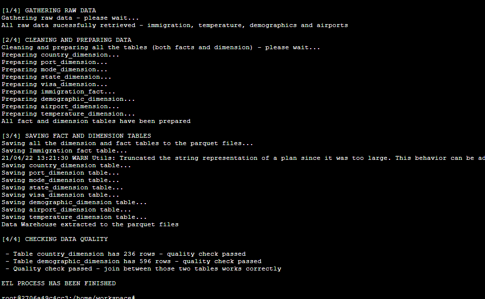

# Data Engineering Capstone Project

## Project: Data Modeling with Postgres

### Overview

The purpose of the data engineering capstone project is to give you a chance to combine what you've learned throughout the program. This project will be an important part of your portfolio that will help you achieve your data engineering-related career goals.

In this project, you can choose to complete the project provided for you, or define the scope and data for a project of your own design. Either way, you'll be expected to go through the same steps outlined below.

### Project Description
#### Step 1: Scope the Project and Gather Data

- Identify and gather the data you'll be using for your project (at least two sources and more than 1 million rows). See Project Resources for ideas of what data you can use.
- Explain what end use cases you'd like to prepare the data for (e.g., analytics table, app back-end, source-of-truth database, etc.)

#### Step 2: Explore and Assess the Data

- Explore the data to identify data quality issues, like missing values, duplicate data, etc.
- Document steps necessary to clean the data

#### Step 3: Define the Data Model

- Map out the conceptual data model and explain why you chose that model
- List the steps necessary to pipeline the data into the chosen data model

#### Step 4: Run ETL to Model the Data

- Create the data pipelines and the data model
- Include a data dictionary
- Run data quality checks to ensure the pipeline ran as expected
    - Integrity constraints on the relational database (e.g., unique key, data type, etc.)
    - Unit tests for the scripts to ensure they are doing the right thing
    - Source/count checks to ensure completeness

#### Step 5: Complete Project Write Up

- What's the goal? What queries will you want to run? How would Spark or Airflow be incorporated? Why did you choose the model you chose?
- Clearly state the rationale for the choice of tools and technologies for the project.
- Document the steps of the process.
- Propose how often the data should be updated and why.
- Post your write-up and final data model in a GitHub repo.
- Include a description of how you would approach the problem differently under the following scenarios:
    - If the data was increased by 100x.
    - If the pipelines were run on a daily basis by 7am.
    - If the database needed to be accessed by 100+ people.

### Project Introduction

The project I have created is to expand U.S. immigration data with additional dimensions. This will allow for wider possibilities when analyzing these data by analysts. In the project I used a star schema with one fact table. For cleaning data, manipulating and creating structure of data warehouse I used Spark, because this technology allow with ease to operations on large data sets. One more thing follows from the use of this technology - data warehouse is saved in parquet file. The use case for this analytical database is to look at this data through the prism of different dimensions and their connections - for example we can find out if there is connection between immigration and demographic or temperature data. It meanse that this data warehouse will allow us to see things like correlation between big aglomerations and immigration, or between warmer places and immigration.

### Data Model

I have implemented star schema. It is the typical schema for a Data Warehouse and together with the snowflake model they are the most popular data warehouse schemas. For cleaning data, creating structure of data warehouse and all operations with data frames and files I used Spark. Data Warehouse schema is saved in parquet file. For this project I used Spark because this technology allows you to easily manipulate large files. Despite the fact that the data for this task was not that large yet, I decided that the data size was sufficient to use a Spark. 

#### Below there is a diagram for implemented Data Warehouse:

#### Below there is a data dictionary for tables:

#### Fact tables:
- ___immigration___ - records with immigration data
    - cicid bigint
    - code_port string 
    - code_state string 
    - visapost string 
    - occup string 
    - entdepa string 
    - entdepd string 
    - entdepu string 
    - matflag string 
    - dtaddto string 
    - gender string 
    - insnum string 
    - airline string 
    - admnum double 
    - fltno string 
    - visatype string 
    - code_visa integer 
    - code_mode integer 
    - code_country_origin integer 
    - code_country_city integer 
    - year integer 
    - month integer 
    - birth_year integer 
    - age integer 
    - counter_summary integer 
    - arrival_date date 
    - departure_date date 
    - arrival_year integer 
    - arrival_month integer 
    - arrival_day integer
    
 
#### Dimension tables:
- ___demographic___ - demographic data
    - state_code string
    - city string
    - state string
    - median_age string
    - male_population string
    - female_population string
    - total_population string
    - number_of_veterans string
    - foreign_born string
    - average_household_size string
    - american_indian_and_alaska_native integer
    - asian integer
    - black_or_african_american integer
    - hispanic_or_atino integer
    - white integer
    
   
- ___temperature___ - temperature data
    - port_code string
    - month integer
    - avg_tempertature double 
    
    
- ___airport___ - airports data
    - ident string
    - type string
    - name string
    - elevation_ft string
    - continent string
    - iso_country string
    - iso_region string
    - municipality string
    - gps_code string
    - iata_code string
    - local_code string
    - coordinates string
    
    
- ___state___ - state codes data
    - state_code string
    - state_name string
    
    
- ___country___ - countries data
    - country_code string
    - country_name string
    
    
- ___visa___ - visa codes data
    - visa_id integer
    - visa_type string
    
    
- ___mode___ - modes data
    - mode_id integer
    - mode_name string
    
    
- ___port___ - ports data
    - port_code string
    - port_name string
    
    
    
    
### Project structure:

1. ___csv_data___ - folder that contains raw data for immigration, demographics, airports and column labels
2. ___static_files___ - folder that contains static files (for example: picture of database schema)
3. ___data_cleaning.py___ - functions for cleaning and preparing tables
4. ___data_gathering.py___ - functions for gathering raw data
5. ___data_paths.py___ - data paths to data
6. ___data_saving.py___ - functions for saving database to PySpark parquet
7. ___data_validation.py___ - functions for data quality checks
8. ___etl.py___ - ETL script of whole process
9. ___etl_jupyter.ipynb___ - Jupyter Notebook with details and explanations
10. ___README.md___ - project description

### ETL Pipeline:

##### ETL process is located in etl.py file. Whole ETL process is based on the following steps:

1. Read raw data from CSV and SAS files.
2. Processing data
    1. Extracting all the information for dimension tables from SAS Label files.
    2. Cleaning and preparing all the dimension and fact tables.
3. Inserting whole Data Warehouse to the parquet.
    1. Inserting fact immigration table to the parquet.
    2. Inserting all dimension tables to the parquet.
4. Run quality check for data warehouse.
    1. Quality check for rows.
    2. Quality check for joins.

### Starting ETL Pipeline

###### !important! Whole ETL process step by step is also in etl_jupyter.ipynb file

We can run whole ETL process with one command:

`python etl.py`

Here is screenshot how whole ETL process look in the console:

